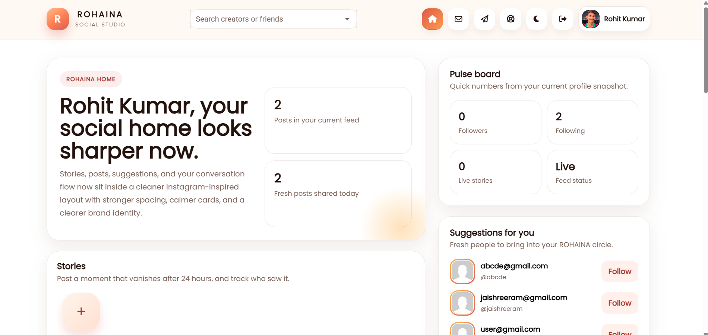
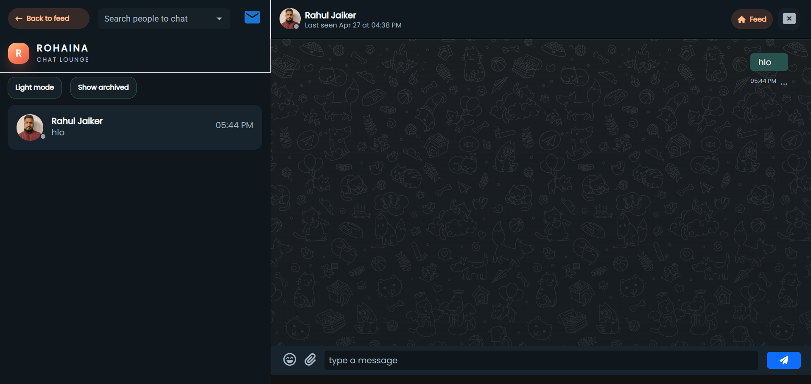
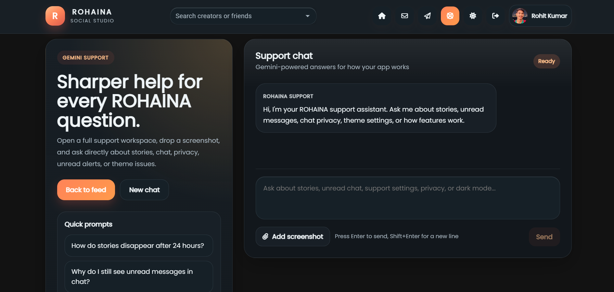
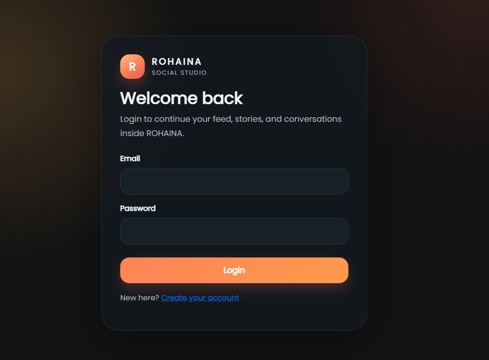

# 🌐 Rohaina - Social Media Web App

A modern **full-stack social media platform** built using the MERN stack.
Rohaina allows users to connect, chat in real-time, and share moments seamlessly.

---

## 🚀 Description

Rohaina is a real-time social media web application where users can:

* Create accounts and securely log in
* Chat with other users in real-time
* Manage chat rooms and conversations
* Experience fast and responsive UI

This project demonstrates strong understanding of **full-stack development, REST APIs, authentication, and real-time communication using Socket.io** — making it perfect for technical interviews like Infosys L3.

---

## ✨ Features

* 🔐 User Authentication (JWT + Passport)
* 💬 Real-time Chat (Socket.io)
* 🧑‍🤝‍🧑 Chat Rooms / Dashboard
* ⚡ Fast & Responsive UI
* 🔒 Secure Password Hashing (bcryptjs)
* 🌐 RESTful APIs
* 📡 Client-Server Architecture

---

## 🛠️ Tech Stack

### 🔹 Frontend

* React.js
* CSS (Update if Tailwind / Bootstrap used)

### 🔹 Backend

* Node.js
* Express.js

### 🔹 Database

* MongoDB (Mongoose)

### 🔹 Other Libraries

* Socket.io
* JSON Web Token (JWT)
* Passport.js
* bcryptjs
* dotenv
* validator

---

## 🔗 Links

* 🌍 Live Deployment: https://your-deployment-link
* 📦 GitHub Repository: https://github.com/YOUR_USERNAME/YOUR_REPO

---

## 📂 Project Setup

### 1️⃣ Clone the Repository

```bash
git clone https://github.com/rohitkumar01603016/Social_media-website-rohaina-.git
cd rohaina
```

---

## ▶️ Running the Project

### 🖥️ Frontend

```bash
cd client
npm install
npm start
```

### ⚙️ Backend

```bash
cd server
npm install
nodemon server.js
```

---

## 📸 Screenshots

### 🏠 Home Page



### 💬 Chat Section



### 📨 Chat Board



### 🔐 Login / Signup Page



---

## ⚙️ Environment Variables

Create a `.env` file in the server folder:

```
MONGO_URI=your_mongodb_connection_string
JWT_SECRET=your_secret_key
PORT=5000
```

---


## 🧠 Key Concepts Used

* REST API Design
* Authentication & Authorization (JWT)
* Real-time Communication (WebSockets - Socket.io)
* MVC Architecture
* Client-Server Model

---


## 👨‍💻 Author

**Rohit Kumar**

---
